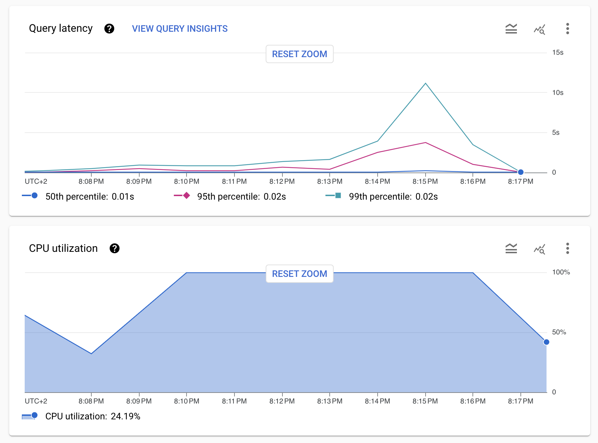

#### mystery revealed

Mysterious throttling was actually a choking CloudSQL (tiny instance)

#### system under test:

- search service spec:
  - 512MB RAM
  - shared-cpu-1x
  - single instance
  - JVM options: `-Xss256k`
  - db connection pool size: 30
- postgres spec:
  - 3.75GB RAM
  - dedicated cpu
  - single instance

#### test setup:

- search loop : 5 sequential requests for subsequent pages fo results
- simplified to warmup + load
    - warmup: 125 requests, 5 users
    - load: 18_750 requests, 75 users

#### test results:

- details: <a href="gatling/2023.10.10-search">[gatling report]</a>
- summary:
    - execution time : 10 minutes
    - 95 percentile response time: ~1s
    - average req/sec: 40
    - all good

CloudSQL's CPU looks fully saturated during test (guess: evaluating our JSONB queries without any indexes):

